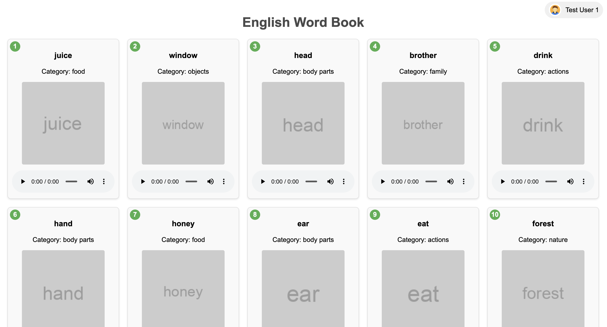

# English Word Book

English Word Book - это веб-приложение для изучения английских слов, разработанное с использованием FastAPI на бэкенде и HTML/JavaScript на фронтенде.

## Основные функции

1. Аутентификация пользователей
2. Отображение списка английских слов с изображениями и аудио произношением
3. Проведение экзаменов для проверки знаний
4. Отслеживание результатов экзаменов

## Технологии

- Backend: Python, FastAPI
- Frontend: HTML, JavaScript, CSS
- База данных: SQLite
- Аутентификация: JWT (JSON Web Tokens)

## Основные принципы

1. **Аутентификация**: Используется JWT для безопасной аутентификации пользователей. Токены хранятся в localStorage браузера.

2. **Безопасность**: Применяются заголовки для предотвращения кэширования чувствительных данных. Пароли пользователей (в данном случае совпадают с именами пользователей) не хранятся в открытом виде.

3. **Генерация аудио**: Для каждого слова генерируется аудиофайл с произношением с помощью библиотеки gTTS (Google Text-to-Speech).

4. **Динамическая загрузка контента**: Слова, информация о пользователе и результаты экзаменов загружаются асинхронно с использованием Fetch API.

5. **Отзывчивый дизайн**: Интерфейс адаптируется к различным размерам экрана с помощью CSS медиа-запросов.

6. **Обработка ошибок**: Реализована обработка ошибок как на стороне клиента, так и на стороне сервера.

7. **Сохранение результатов**: Результаты экзаменов сохраняются в базе данных SQLite и могут быть просмотрены пользователями.

8. **Генерация слов**: Слова генерируются с помощью функции get_random_words() из модуля generate_words.py. Детали реализации этой функции не представлены в текущем коде.

## Структура проекта

- `base.py`: Основной файл сервера FastAPI
- `static/`: Директория для статических файлов
  - `index.html`: Основная страница приложения
  - `login.html`: Страница входа
- `generate_words.py`: Скрипт для генерации случайных слов (не показан в предоставленном коде)

## Запуск проекта

1. Установите необходимые зависимости:
   ```
   pip install fastapi uvicorn pydantic jose gtts
   ```

2. Запустите сервер:
   ```
   python base.py
   ```

3. Откройте браузер и перейдите по адресу `http://localhost:8000`

## Дальнейшее развитие

- Добавление возможности регистрации новых пользователей
- Реализация системы уровней сложности
- Добавление статистики прогресса пользователя
- Интеграция с внешними API для расширения базы слов
- Внедрение методов машинного обучения для более эффективной генерации и подбора слов